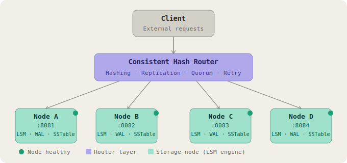
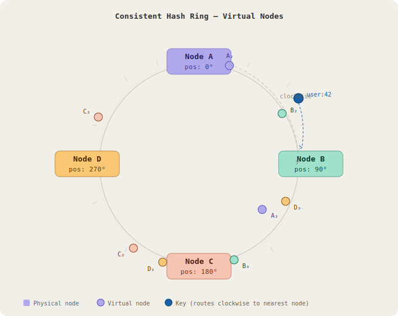
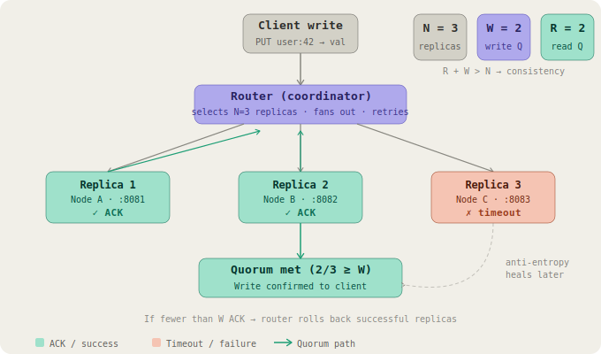
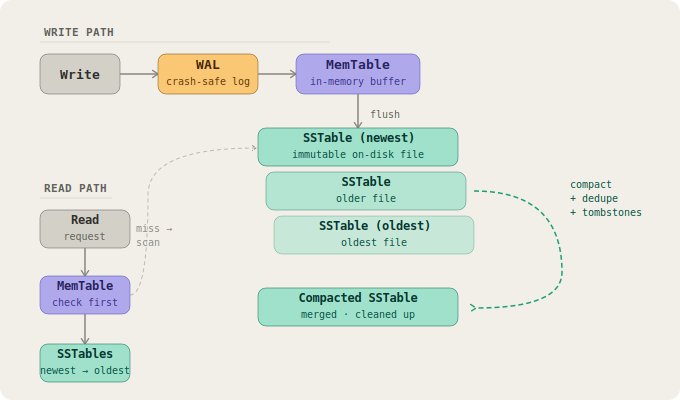

# 🚀 Distributed Key-Value Store with Consistent Hashing

A production-inspired **distributed key-value storage system** built using **Java + Spring Boot**, implementing core distributed system concepts like **consistent hashing, replication, quorum-based reads/writes, fault tolerance, self-healing mechanisms, and an LSM-inspired storage engine**.

---

# 📌 Overview

This project simulates how modern distributed databases (like Cassandra/DynamoDB) work internally.

It consists of two main components:

* **Router Service (consistent-hashing)**
  Responsible for request routing, hashing, replication, and system coordination.

* **Node Service (node-service)**
  Represents individual storage nodes that store key-value data, backed by an LSM-inspired storage engine with crash recovery support.

---

# 🧱 Architecture



Each node runs an independent LSM-inspired storage engine with its own MemTable, SSTables, and Write-Ahead Log.

---

# ⚙️ How It Works

## 🔹 Consistent Hashing



* Keys and nodes are mapped to a hash ring (circular keyspace)
* Each key is routed to the nearest clockwise node
* Ring is implemented using a `TreeMap` for efficient wrap-around lookups
* Supports **minimal data movement during scaling**

---

## 🔹 Virtual Nodes

* Each physical node is represented multiple times on the ring
* Ensures **better load distribution** across nodes

---

## 🔹 Replication

* Each key is stored on **N consecutive nodes** on the ring
* Provides **fault tolerance** — data survives node failures

---

## 🔹 Quorum-based Reads/Writes



| Parameter | Meaning            |
| --------- | ------------------ |
| N         | Replication factor |
| W         | Write quorum       |
| R         | Read quorum        |

Condition:

```
R + W > N
```

Ensures **strong eventual consistency**.

---

## 🔹 Write Flow

```
Client → Router → N nodes (with retry on transient failures)
        → success if ≥ W nodes succeed
        → else rollback
```

Failed writes trigger a rollback across nodes that did succeed, preventing partial write divergence.

---

## 🔹 Read Flow

```
Client → Router → multiple replicas
        → quorum decision across R responses
        → read repair triggered on replica mismatch
```

---

# 🗄️ Storage Engine

Each node uses an **LSM-inspired storage engine** for durable, high-throughput writes.



## Write Path

```
Write → WAL (Write-Ahead Log) → MemTable (in-memory)
      → flush to SSTable when MemTable threshold reached
```

## Read Path

```
Read → MemTable → SSTables (newest first)
     → return first match found
```

## Components

**MemTable** — in-memory write buffer backed by a `ConcurrentHashMap`. Absorbs writes at high speed before flushing to disk.

**SSTables (Sorted String Tables)** — immutable on-disk files written when the MemTable exceeds its flush threshold. Reads scan SSTables from newest to oldest.

**Write-Ahead Log (WAL)** — every write is appended to the WAL before hitting the MemTable. On crash, the WAL is replayed to restore in-flight writes that weren't yet flushed.

**Compaction** — background process that merges SSTables, removes duplicate keys, and reclaims space.

**Tombstones** — deletes are written as tombstone markers rather than immediate removals, which are resolved during compaction.

---

# 🔁 Self-Healing Mechanisms

## 🟢 Read Repair

* Detects replica divergence during reads
* Asynchronously pushes the latest value to stale replicas
* Keeps **hot data consistent** without extra background load

---

## 🟡 Anti-Entropy (Background Repair)

* Runs periodically via `@Scheduled` background job
* Compares replicas across all nodes
* Pushes missing or stale values to lagging replicas
* Ensures **eventual consistency** for cold/infrequently-read data

---

## 🔵 Node Recovery

When a node comes back UP after downtime:

* Detects keys it is responsible for but is missing
* Pulls latest values from peer replicas
* Ensures **no data loss after downtime**

---

## 🔴 Rebalancing

Triggered on node addition or removal:

1. Identify keys that now belong to different nodes
2. Copy data to correct target nodes
3. Verify successful transfer
4. Delete from nodes no longer responsible

---

# 🛡️ Fault Tolerance

* Detects unhealthy nodes via heartbeat health checks
* Retries failed requests with configurable retry logic
* Skips unhealthy nodes during routing
* Fails over reads/writes to healthy replicas automatically

---

# 🔒 Concurrency Model

* **`ConcurrentHashMap`** — thread-safe in-memory storage for MemTable and node registry
* **`ReadWriteLock`** — protects the hash ring during rebalancing and topology changes
* **`@Async`** — read repair and replica sync run asynchronously to avoid blocking client requests
* **`@Scheduled`** — anti-entropy repair runs as a background scheduled task without manual coordination

---

# 🗃️ Persistence & Metadata

Node registry and key ownership metadata are persisted using **Spring Data JPA** backed by an **H2 database**, ensuring the router can reconstruct system state after a restart without relying purely on in-memory state.

| Store              | Technology       | Purpose                          |
| ------------------ | ---------------- | -------------------------------- |
| Node Registry      | H2 + JPA         | Tracks live nodes and their status |
| Key Registry       | H2 + JPA         | Tracks key-to-node ownership     |
| Key-Value Data     | LSM Engine       | Actual stored values per node    |
| Crash Recovery     | WAL Replay       | Restores writes lost on crash    |

---

# ⚡ Features Implemented

* ✅ Consistent Hashing Ring (TreeMap-based)
* ✅ Virtual Nodes
* ✅ Replication (N copies)
* ✅ Quorum Reads/Writes
* ✅ Partial Write Rollback
* ✅ Retry Mechanism
* ✅ Node Health Check (Heartbeat)
* ✅ Failover Handling
* ✅ Data Rebalancing
* ✅ Read Repair
* ✅ Anti-Entropy Background Sync
* ✅ Node Recovery
* ✅ LSM-inspired Storage Engine
* ✅ MemTable + SSTable
* ✅ Write-Ahead Log (WAL) + Crash Recovery
* ✅ Compaction + Tombstone Deletes
* ✅ Thread-Safe Concurrency Model
* ✅ Metadata Persistence (H2 + JPA)

---

# 🧠 Design Trade-offs

| Feature             | Choice                              | Reasoning                                      |
| ------------------- | ----------------------------------- | ---------------------------------------------- |
| Consistency model   | Eventual consistency                | Favours availability and partition tolerance    |
| Availability        | High                                | Quorum allows progress despite node failures   |
| Partition tolerance | Supported                           | Ring-based routing survives partial failures   |
| Write durability    | WAL before MemTable                 | Crash-safe without sacrificing write speed     |
| Delete strategy     | Tombstones                          | Safe for replicated systems; resolved at compaction |
| Concurrency         | ReadWriteLock + ConcurrentHashMap   | Fine-grained locking over coarse synchronisation |

---
